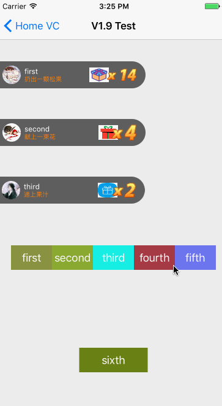

[](https://github.com/Jonhory/LiveSendGift/actions/workflows/ci.yml)

## 感谢
* 得益于某位不愿留名的同学的帮助，队列模式已经较好的实现了。
* 感谢[gxtai](https://github.com/gxtai)发现并解决[内存释放](https://github.com/Jonhory/LiveSendGift/issues/20)问题

## 重要信息
* **2026年07月14日 V2.1.0 新增 Swift 版（`LiveSendGiftSwift`）**：按 ObjC 版逻辑完整移植、行为一致、零三方依赖，推荐新项目使用，详见[Swift 版说明](#Swift)。本次改动由 AI（Claude）协助推进完成。
* **2026年07月14日 发布 V2.0.0**：破坏性升级，详见[V2.0 版本说明](#V2)。本次改动由 AI（Claude）协助推进完成。
* 2017年09月25日18:42:00 修复了在iOS11下必现`EXC_BAD_INSTRUCTION (code=EXC_I386_INVOP, subcode=0x0)`的崩溃BUG。
* ~~已知bug提示：在替换模式`LiveGiftAddModeReplace`下使用`animatedWithGiftModel`方法将导致UI效果不理想的bug。建议是`animatedWithGiftModel`方法使用于`LiveGiftAddModeAdd`模式。~~（V2.0 重构了连击定时器逻辑，如仍能复现请提 issue）
* 2017年12月25日11:39:39 修复在iOS11下可能出现的`.cxx destruct`崩溃问题。
* 2021年3月23日确认了`for`循环添加礼物时会出现后续[礼物`toNumber`变大](https://github.com/Jonhory/LiveSendGift/issues/19)的问题。<del>已提交修复代码，待开发者确认是否完全修复。</del>
* 2021年7月12日确认并解决了[内存释放](https://github.com/Jonhory/LiveSendGift/issues/20)问题。
* 2022年11月25日确认并修复了[`addLiveGiftShowModel:showNumber:`显示异常](https://github.com/Jonhory/LiveSendGift/issues/21)问题。
	
	### 请使用2021/03/25之前的代码的开发者注意

	以下代码需调整
	
	```
	if ([oldKey isEqualToString:key]) {
		oldNumber = oldModel.toNumber;
		showModel.toNumber += oldNumber;
		[self.waitQueueArr removeObject:oldModel];
		break;
	}
	```

	修改为：
	
	```
	if ([oldKey isEqualToString:key] && oldModel.animatedTimer == nil) {
		oldNumber = oldModel.toNumber;
		showModel.toNumber += oldNumber;
		[self.waitQueueArr removeObject:oldModel];
		break;
	}
	```

## 导航
* [目标](#目标)
* [版本更新说明](#版本更新说明)
* [最新版本](#最新版本)
* [快速使用](#快速使用)
* [自定义配置](#自定义配置)

## <a id="目标"></a>目标:

* 弹幕过几秒自动消失
* 实现A用户弹幕出现时，B用户发送礼物，B用户弹幕在A用户弹幕下方,A/B用户弹幕存在时，A/B用户连续发送礼物，弹幕显示的礼物数量增加，谁的礼物数量较大，谁的弹幕在上方。
* A/B用户弹幕存在时，C用户发送礼物，A/B用户中较早出现的弹幕被替换成C用户的弹幕数据，并且C用户的弹幕处于下方

### <a id="版本更新说明"></a>版本更新:

#### V1.0
* 大致实现了不同用户增加弹幕的效果

#### V1.1
* 实现了用户连续发送数字增加效果
* 实现了新增弹幕从空位出现的效果

#### V1.2
* 实现了第二个用户之后送礼物替换较早的弹幕效果(完善)

#### V1.3
* 实现了上面的视图移除后，正在连击的下面的视图移动到上面的效果

#### V1.4
* 实现了目标效果😊😊😊

#### V1.5
* 实现了自定义最大礼物数量的需求

#### V1.6
* 新增了自下而上的展现效果

#### V1.7
* 解决了一个视图显示BUG，现在几乎不会出现该BUG。

#### V1.8
* 支持向左移除弹幕，支持左边出现动画效果，增加弹幕移除后的回调代理。

#### <a id="最新版本"></a> V1.901测试版
* 支持从1增加到某个数字的动画（在替换模式`LiveGiftAddModeReplace`下存在小bug，如果有某猿能提供帮助将不胜感激）
* 支持队列模式（如下GIF图，注意看鼠标～）
* 移除的模式增加无动画移除
* 修改了部分枚举名称更符合OC语法
* 暴露了动画时长属性，方便开发者依据不同情况自行修改



#### <a id="V2"></a> V2.0.0（2026-07-14，AI 协助推进）

> 本版本为破坏性升级（major），最低支持 iOS 12.0。全部改动由 AI（Claude）协助完成，
> 包含重构、修复、单元测试与发布配置。

**修复**

* 修复挂起多年的 [issue #17](https://github.com/Jonhory/LiveSendGift/issues/17)：同一弹幕并发连击时会叠加多个定时器导致数字失控。现在同 key 连击会合并进已有定时器（`toNumber` 累加），并有单元测试保障。
* 修复弹幕移除回调中裸索引替换可能导致的越界崩溃（增加边界防护）。
* 修复固定轨道 demo 中"同时添加多条"按钮无响应的问题。
* 修复左移出弹幕不参与轨道补位判断的问题（原实现用浮点相等判断只覆盖右出场景）。

**重构（破坏性变更）**

* 全部配置由全局 `static` 改为**实例属性**，多个 `LiveGiftShowCustom` 实例互不影响：`maxRailwayCount` / `railwayCanExchange` / `showMode` / `hiddenMode` / `appearMode` / `interfaceDebugEnabled`。旧 setter 方法保留但标记 deprecated。
* 公开 API **线程安全**：非主线程调用 `addLiveGiftShowModel:` / `animatedWithGiftModel:` 会自动转到主队列。
* `LiveUserModel` 新增 `userId`：同名用户不再被错误合并（不传时退化为按 `name` 区分）。
* `LiveGiftShowNumberView` 去掉带自增副作用的 `number` getter，改为显式的 `resetNumber:` / `increaseNumber` / `currentNumber`。
* 命名修正：`creatDate`→`createDate`，`hiddenModel`（属性）→`hiddenMode`。
* **移除 Masonry 依赖**（官方 2017 年后未再发版，阻塞 pod 校验与 SPM），布局改用系统 `NSLayoutAnchor`。
* 弹幕移除定时器改用 block 版 `NSTimer`，不再强引用视图。

**工程**

* 支持 **CocoaPods**（`pod 'LiveSendGift'`）与 **Swift Package Manager**。
* 库资源独立为 `LiveSendGiftAssets.xcassets`，三种集成方式均可正确加载图片。
* 新增核心队列/计数逻辑的单元测试（覆盖 #17/#19/#21 的回归场景）。
* 最低部署目标升至 iOS 12.0。
* 全部头文件补充 nullability 标注，Swift 侧不再是隐式解包可选值。
* 内置 `PrivacyInfo.xcprivacy` 隐私清单（零收集、零 required-reason API）。
* **SDWebImage 变为可选依赖**：新增 `webImageLoader` 注入点，宿主可用 Kingfisher/自研加载器；CocoaPods 提供零三方依赖的 `LiveSendGift/Core` subspec。
* demo 移除 MJExtension 依赖。
* 新增 GitHub Actions CI（构建 + 测试 + pod lint）。

#### <a id="Swift"></a> V2.1.0 Swift 版 LiveSendGiftSwift（2026-07-14，AI 协助推进）

按 ObjC 版（V2.0）逻辑完整移植的 Swift 实现，位于 `Sources/LiveSendGiftSwift/`，与 ObjC 版共存于同一仓库：

* **行为一致**：连击合并、轨道排序、队列/替换模式、线程安全、userId 区分同名用户——单元测试与 ObjC 版一一对应。
* **零三方依赖**：内置 URLSession 图片加载器，可通过 `webImageLoader` 注入 Kingfisher/SDWebImage/自研加载器。
* **API 更 Swift**：枚举小写 case、闭包回调（`onGiftRemoved`）取代 delegate。

```swift
import LiveSendGiftSwift

let giftShow = LiveGiftShowCustom.add(to: view, y: view.safeAreaInsets.top + 10)
giftShow.addMode = .queue
giftShow.maxRailwayCount = 3
giftShow.onGiftRemoved = { model in print("移除：\(model.user.name ?? "")") }

let model = LiveGiftShowModel(
    gift: LiveGiftItem(type: "0", name: "松果", picUrl: "https://...", rewardMsg: "扔出一颗松果"),
    user: LiveGiftUser(userId: "1001", name: "小明", iconUrl: "https://..."))
giftShow.add(model)            // 计数 +1
giftShow.animate(with: model)  // 连击动画到 model.toNumber
```

安装：`pod 'LiveSendGiftSwift'`，或 SPM 选择 `LiveSendGiftSwift` product。

ObjC 版（`LiveSendGift`）自 V2.1 起进入维护模式，只修 bug 不加新功能。

### 安装

**CocoaPods**

```ruby
pod 'LiveSendGift', '~> 2.0'          # 默认含 SDWebImage
# 或者：零三方依赖，配合 webImageLoader 注入自己的图片加载
pod 'LiveSendGift/Core', '~> 2.0'
```

使用自研/Kingfisher 等加载器时注入：

```objc
_customGiftShow.webImageLoader = ^(UIImageView *imageView, NSString *urlString, UIImage *placeholder) {
    // 用你的图片库加载 urlString 到 imageView，placeholder 为占位图
};
```

**Swift Package Manager**

```
https://github.com/Jonhory/LiveSendGift.git
```

**手动集成**

拷贝 `LiveSendGift/LiveGiftShowView/` 整个目录（含 `LiveSendGiftAssets.xcassets`）到工程，另需引入 [SDWebImage](https://github.com/rs/SDWebImage)。

### 工程结构与打开方式

本仓库同时包含 CocoaPods 工程（demo + ObjC 库）与 SPM 包（含 Swift 版），请按需选择入口：

| 想看什么 | 打开方式 |
|---|---|
| demo + ObjC 库（日常开发、跑模拟器） | 打开 `LiveSendGift.xcworkspace` |
| Swift 版源码（`Sources/LiveSendGiftSwift/`，独立编译 / 跑 SPM 测试） | Xcode 菜单 File → Open 直接选择**仓库根目录文件夹**，Xcode 会以 SPM 包模式打开 |

注意：

* 项目使用 CocoaPods，**不要单独打开 `LiveSendGift.xcodeproj`**——缺少 Pods 工程会导致 SDWebImage 头文件与链接缺失，编译报错。`.xcodeproj` 只是 workspace 的组成部分。首次打开前先执行 `pod install`。
* Swift 版只挂在 `Package.swift` 下，**不在 workspace 的文件导航器里**。若想在同一个 workspace 中看到全部代码，可以把仓库根目录（`Package.swift` 所在文件夹）拖进 workspace 侧边栏，作为 local package reference。

### <a id="快速使用"></a>快速使用
* 使用的第三方库:
  * [SDWebImage](https://github.com/rs/SDWebImage)

* 两个模型:`LiveGiftListModel`和`LiveUserModel`
  * `LiveGiftListModel `是用来显示弹幕上右侧礼物图片`picUrl`和打赏的语句`rewardMsg`的，礼物有`type`字段
  * `LiveUserModel `是用来显示送礼物的人的名称`name`和头像`iconUrl`，V2.0 起建议传`userId`（用于区分同名用户，不传则按`name`区分）
  
* 导入`#import "LiveGiftShowCustom.h"`

* `@property (nonatomic ,weak) LiveGiftShowCustom * customGiftShow;
`

```
/*
 礼物视图支持很多配置属性，开发者按需选择。
 V2.0 起全部为实例属性，多个实例互不影响。
 */
- (LiveGiftShowCustom *)customGiftShow{
    if (!_customGiftShow) {
        // 建议按安全区计算 y，避免被导航栏遮挡
        _customGiftShow = [LiveGiftShowCustom addToView:self.view y:self.view.safeAreaInsets.top + 10];
        _customGiftShow.addMode = LiveGiftAddModeQueue;
        _customGiftShow.maxRailwayCount = 3;
        _customGiftShow.showMode = LiveGiftShowModeFromTopToBottom;
        _customGiftShow.appearMode = LiveGiftAppearModeLeft;
        _customGiftShow.hiddenMode = LiveGiftHiddenModeNone;
        _customGiftShow.interfaceDebugEnabled = YES;
        _customGiftShow.delegate = self;
    }
    return _customGiftShow;
}
```  

* 在开发中使用

```
LiveGiftShowModel * showModel = [LiveGiftShowModel giftModel:self.giftArr[3] 
                                                   userModel:self.firstUser];
[self.customGiftShow addLiveGiftShowModel:showModel];
```
即可完成接入。每一次点击只需要`[self.customGiftShow addLiveGiftShowModel:showModel];`即可自动计数加一。最高支持显示9999。

* V2.0 起公开 API 线程安全，可直接在 IM/网络回调线程调用，内部会自动转到主队列。

### 特别说明

* `LiveGiftShowCustom.m`中（V2.0 起使用系统 NSLayoutAnchor 布局，宽度与`LiveGiftShowView.h`的`kViewWidth`保持同源）

```
#pragma mark - 初始化
+ (instancetype)addToView:(UIView *)superView y:(CGFloat)y {
    LiveGiftShowCustom * v = [[LiveGiftShowCustom alloc]init];
    v.userInteractionEnabled = NO; // 保证弹幕后面的视图能响应点击事件
    [superView addSubview:v];
    v.translatesAutoresizingMaskIntoConstraints = NO;
    v.heightConstraint = [v.heightAnchor constraintEqualToConstant:(kViewHeight + kGiftViewMargin) * (v.maxRailwayCount - 1) + kViewHeight];
    [NSLayoutConstraint activateConstraints:@[
        [v.widthAnchor constraintEqualToConstant:kViewWidth],
        v.heightConstraint,
        [v.leftAnchor constraintEqualToAnchor:superView.leftAnchor],
        // y 的设定应注意最大礼物数量时不要超出屏幕边界
        [v.topAnchor constraintEqualToAnchor:superView.topAnchor constant:y],
    ]];
    v.backgroundColor = [UIColor clearColor];
    return v;
}
```

### <a id="自定义配置"></a>自定义配置
* `LiveGiftShowCustom` 管理所有弹幕的视图

|两个弹幕之间的高度差|两个交换动画时长|
|:----------------:|:------------:|
|kGiftViewMargin  |kExchangeAnimationTime|
|50.0               |0.25         |

* `LiveGiftShowView`一个弹幕的视图

|弹幕背景宽|弹幕背景高|送礼者名称字号|送礼者名称文字颜色|礼物寄语字号|礼物寄语文字颜色|
|:------:|:------:|:------:|:------:|:------:|:------:|
|kViewWidth|kViewHeight|kNameLabelFont|kNameLabelTextColor|kGiftLabelFont|kGiftLabelTextColor|
|240.0|44.0|12.0|whiteColor|10.0|orangeColor|

|每个数字图片宽度|弹幕几秒后消失|数字改变动画时长|弹幕消失动画时长|
|:------:|:------:|:------:|:------:|
|kGiftNumberWidth|kTimeOut|kNumberAnimationTime|kRemoveAnimationTime|
|15.0|3|0.25|0.5|

## 反馈

使用过程中遇到问题或有建议，请直接在本项目提 [issue](https://github.com/Jonhory/LiveSendGift/issues)。

## License

本项目基于 [MIT License](LICENSE) 开源。

