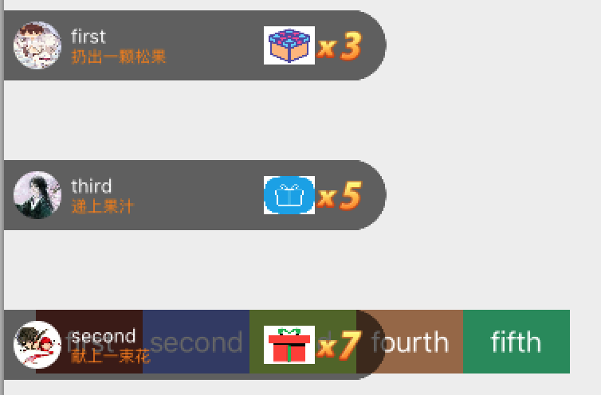

# LiveSendGift

[](https://github.com/Jonhory/LiveSendGift/actions/workflows/ci.yml)

[中文文档](README.md)

A lightweight **live-streaming gift banner** component for iOS: combo counters, rail sorting by gift count, replace/queue modes, and enter/leave animations.



## Scope

LiveSendGift renders the classic "gift combo banner strip" (avatar + message + animated `x N` counter). It is **not** a full-screen gift effect engine — for large animated effects, pair it with SVGA / VAP / Lottie. Both can coexist: banners for combos, effect engines for big gifts.

## Features

- Combo counting with pop animation (`x 1` → `x 9999`)
- Multiple rails, sorted by gift count (biggest on top), with slot-reuse
- Two overflow strategies: **replace** the oldest banner or **queue** new ones
- Enter from left / leave left or right / no-animation modes
- Instance-level configuration, thread-safe public API (calls from any thread are dispatched to main)
- Users disambiguated by `userId` (falls back to name)
- Pluggable image loader (`webImageLoader`) — use Kingfisher, SDWebImage, or your own
- Privacy manifest included; unit-tested core logic with CI

## Requirements

iOS 12.0+. Two implementations live in this repo:

| Module | Language | Dependencies | Status |
|---|---|---|---|
| `LiveSendGiftSwift` | Swift | none | **recommended for new projects** |
| `LiveSendGift` | Objective-C | SDWebImage (optional via `Core` subspec) | maintenance mode |

## Installation

**CocoaPods**

```ruby
pod 'LiveSendGiftSwift', '~> 2.1'          # Swift, zero dependencies
# or the Objective-C version:
pod 'LiveSendGift', '~> 2.1'               # with SDWebImage
pod 'LiveSendGift/Core', '~> 2.1'          # zero dependencies + inject your loader
```

**Swift Package Manager**

```
https://github.com/Jonhory/LiveSendGift.git
```

Pick the `LiveSendGiftSwift` (or `LiveSendGift`) product.

## Quick start (Swift)

```swift
import LiveSendGiftSwift

let giftShow = LiveGiftShowCustom.add(to: view, y: view.safeAreaInsets.top + 10)
giftShow.addMode = .queue
giftShow.maxRailwayCount = 3
giftShow.onGiftRemoved = { model in print("removed: \(model.user.name ?? "")") }

let model = LiveGiftShowModel(
    gift: LiveGiftItem(type: "0", name: "Pinecone", picUrl: "https://...", rewardMsg: "threw a pinecone"),
    user: LiveGiftUser(userId: "1001", name: "Alice", iconUrl: "https://..."))

giftShow.add(model)            // +1 per call
giftShow.animate(with: model)  // combo animation up to model.toNumber
```

## Quick start (Objective-C)

```objc
#import "LiveGiftShowCustom.h"

LiveGiftShowCustom *giftShow = [LiveGiftShowCustom addToView:self.view y:self.view.safeAreaInsets.top + 10];
giftShow.addMode = LiveGiftAddModeQueue;
giftShow.maxRailwayCount = 3;

LiveGiftShowModel *model = [LiveGiftShowModel giftModel:gift userModel:user];
[giftShow addLiveGiftShowModel:model];
```

## More

- [CHANGELOG](CHANGELOG.md) · [V1 → V2 migration guide (Chinese)](MIGRATION.md) · [Contributing](CONTRIBUTING.md)
- Full configuration reference: see the [Chinese README](README.md)

## License

[MIT](LICENSE)
